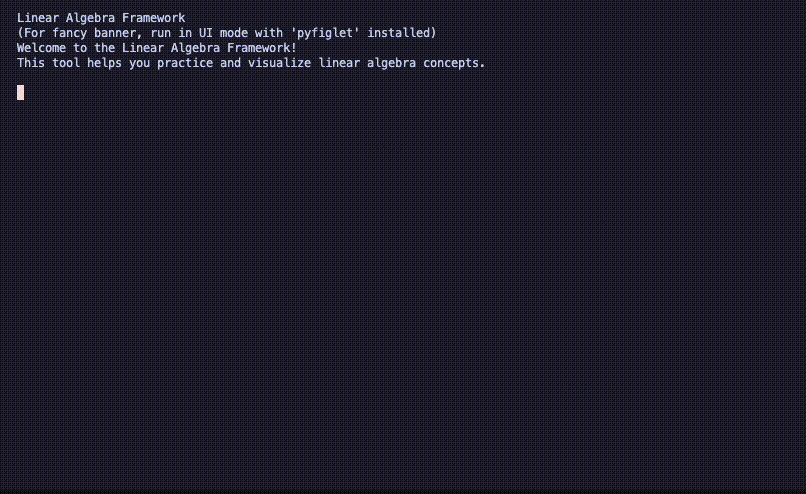

# Doruk's Linear Algebra Calculator [](https://github.com/peaktwilight/linear-algebra-calculator/releases/tag/v1.5)



A comprehensive toolkit for learning and solving linear algebra problems. This project offers three main interfaces:
-   **TUI (Text-based User Interface)**: An interactive, terminal-based experience (default).
-   **CLI (Command-Line Interface)**: For direct command execution and scripting.
-   **Web App**: A graphical interface accessible at [lag.doruk.ch](https://lag.doruk.ch), featuring calculators and interactive quizzes.

## Features

-   Interactive UI with explanations and guidance.
-   Core linear algebra operations:
    -   **Vectors**: Normalization, projections, angles, cross products.
    -   **Matrices**: Addition, multiplication, Gaussian elimination.
    -   **Geometric**: Distances, plane intersections.
-   Search, help system, example exercises, and quizzes.

## File Structure

-   `linalg.py`: Main entry point (recommended).
-   `linalg_cli.py`: CLI core functions.
-   `linalg_ui.py`: Rich TUI (runnable).
-   `streamlit_app.py`: Web interface.
-   `help_guides.py`: Learning resources.
-   `given_reference/`: Reference code.

## Installation

```bash
# Clone the repository
git clone https://github.com/peaktwilight/linear-algebra-calculator.git
cd linear-algebra-calculator

# Install dependencies
pip install numpy sympy scipy rich questionary
```

> **Note**: The `core.py` module is in `given_reference/` and imported from there.

## Usage

The primary way to use the calculator is via `linalg.py`.

### Unified Launcher (`linalg.py`)

```bash
# Interactive UI mode (default)
python linalg.py

# CLI mode
python linalg.py --cli

# Example: Direct command execution
python linalg.py --cli --command "solve_gauss --matrix '1,2,3; 4,5,6'"
```

For detailed CLI command help:
```bash
python linalg.py --cli --help
```

### Alternative Interfaces

-   **Direct TUI**: `python linalg_ui.py`
-   **Direct CLI**: `python linalg_cli.py <command> [options]` (e.g., `python linalg_cli.py normalize_vector --vector "3,4"`)

## Learning Resources

The Interactive UI (`python linalg.py`) includes a "Learning Resources" section with:
- Help topics & explanations.
- Example exercises with solutions.
- Problem-solving guides & quizzes.

## Web Interface (Streamlit)

A Streamlit web interface offers a graphical experience. It is hosted online at:
**[lag.doruk.ch](https://lag.doruk.ch)**

To run it locally:
```bash
# Install additional dependencies for the web app
pip install streamlit pandas matplotlib plotly

# Run the Streamlit app
streamlit run streamlit_app.py
```
The web interface features:
- Interactive visualizations.
- Step-by-step solutions.
- Modern UI.
- Interactive Quizzes.

## Local Testing with Docker

Easily test the Streamlit application locally using Docker.
```bash
# Run with the convenience script
./run_docker.sh
# Access at http://localhost:8501
```
For more details, see `DOCKER.md`.

## Deployment to Fly.io

The Streamlit app can be deployed to Fly.io.
```bash
# Deploy with the convenience script
./deploy_to_fly.sh
```
For manual deployment and custom domain setup, see `DEPLOY.md`.

---

© 2025 Doruk | FHNW Linear Algebra Module
